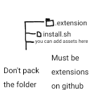

# Sdx4ip

# How to install Sdx4ip

You need enter the command

Xfce4
```
apt install git -y && git clone https://github.com/vanapavluk9/sdx4ip-1.git && chmod +x sdx4ip-1/installingdebianinphonexfce4.sh && ./sdx4ip-1/installingdebianinphonexfce4.sh
```

And you need to install termux-x11
Here's link : https://github.com/termux/termux-x11/releases

If you don't have a termux here's link : https://f-droid.org/repo/com.termux_1022.apk

And update 1.1 : added installing extensions (template image : )

You can add a extension in issue tab here

On other desktop environments coming soon
